## 一. 概述

本项目应用于生产生活实际，具有一定价值，在日常生活中对服装类商品的订单进行系统性的整理，相较于手工人力传统方式进行数据收集整理，具有一定的使用价值。

## 二. 需求与功能分析 

服装类商品管理系统，可用于餐厅等机构的订单信息管理，查询，更新与维护，使用方便，易用性强。该系统实现的大致功能；用户登陆。提供了信息的查询，添加，修改，删除；查询部门销售额，修改密码等功能。管理员管理拥有最高的权限。其提供了简单.方便的操作。订单管理系统是一个专为连锁店、超市等商业场所提供订单管理平台的系统。该系统的目标是建立一个订单管理平台，为需要合理规划超市供应链、供应商以及工作人员提供的便捷的平台。该系统的主要业务需求包括记录并维护某超市的供应商信息，以及该超市与供应商之间的交易订单信息，包括三种角色，系统管理员经理，普通员工。

## 三. 数据库设计

## 1. 添加用户及权限管理

oracle中的表就是一张存储数据的表。表空间是逻辑上的划分。方便管理的。

数据表空间 (Tablespace) 

存放数据总是需要空间， Oracle把一个数据库按功能划分若干空间来保存数据。当然数据存放在磁盘最终是以文件形式，所以一盘一个数据表空间包含一个以上的物理文件
 数据表。

在仓库，我们可能有多间房子，每个房子又有多个货架，每架又有多层。 我们在数据库中存放数据，最终是数据表的单元来存储与管理的。
 数据文件。

以上几个概念都是逻辑上的， 而数据文件则是物理上的。就是说，数据文件是真正“看得着的东西”，它在磁盘上以一个真实的文件体现。

创建表空间 USERS02：


建好tablespace, 就可以建用户CY：

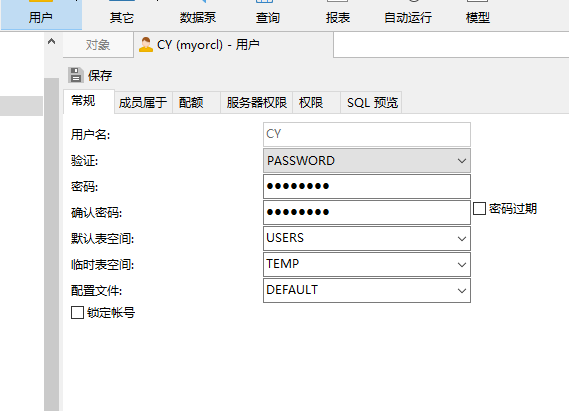

成员属于这点上 Connect和Recourse：

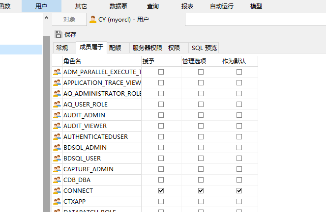

授权 create view：


### 使用用户登录本地Oracle数据库

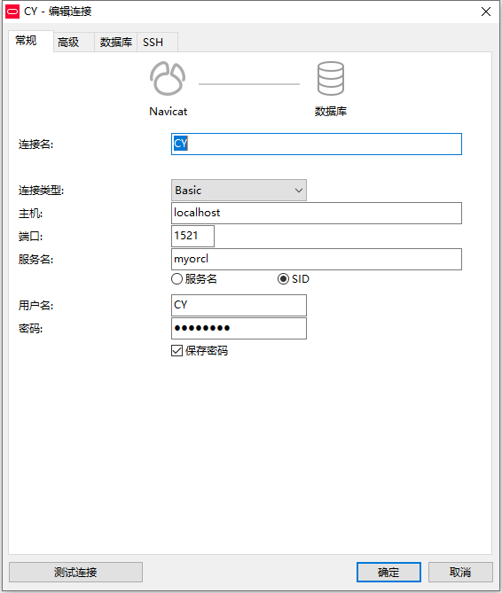

 

## 4. 利用新创建的用户创建了五个表

```
CREATE TABLE DEPARTMENTS (
	DEPARTMENT_ID NUMBER ( 6, 0 ) NOT NULL,
	DEPARTMENT_NAME VARCHAR2 ( 40 BYTE ) NOT NULL,
	CONSTRAINT DEPARTMENTS_PK PRIMARY KEY ( DEPARTMENT_ID )
	);

CREATE TABLE EMPLOYEES (
	EMPLOYEE_ID NUMBER ( 6, 0 ) NOT NULL,
	NAME VARCHAR2 ( 40 BYTE ) NOT NULL,
	EMAIL VARCHAR2 ( 40 BYTE ),
	PHONE_NUMBER VARCHAR2 ( 40 BYTE ),
	HIRE_DATE DATE NOT NULL,
	SALARY NUMBER ( 8, 2 ),
	MANAGER_ID NUMBER ( 6, 0 ),
	DEPARTMENT_ID NUMBER ( 6, 0 ),
	PHOTO BLOB,
	CONSTRAINT EMPLOYEES_PK PRIMARY KEY ( EMPLOYEE_ID )
	);
	
	
	CREATE TABLE PRODUCTS (
	PRODUCT_NAME VARCHAR2 ( 40 BYTE ) NOT NULL,
	PRODUCT_TYPE VARCHAR2 ( 40 BYTE ) NOT NULL,
	CONSTRAINT PRODUCTS_PK PRIMARY KEY ( PRODUCT_NAME )
	);


CREATE GLOBAL TEMPORARY TABLE "ORDER_ID_TEMP" ( "ORDER_ID" NUMBER ( 10, 0 ) NOT NULL ENABLE, CONSTRAINT "ORDER_ID_TEMP_PK" PRIMARY KEY ( "ORDER_ID" ) ENABLE ) ON COMMIT DELETE ROWS;


COMMENT ON TABLE "ORDER_ID_TEMP" IS '用于触发器存储临时ORDER_ID';


CREATE TABLE ORDERS (
	ORDER_ID NUMBER ( 10, 0 ) NOT NULL,
	
	ORDER_DATE DATE NOT NULL,
	门店号 NUMBER ( 6, 0 ) NOT NULL,

	TRADE_RECEIVABLE NUMBER ( 8, 2 ) DEFAULT 0 
	) TABLESPACE USERS PCTFREE 10 INITRANS 1 STORAGE ( BUFFER_POOL DEFAULT ) NOCOMPRESS NOPARALLEL PARTITION BY RANGE ( ORDER_DATE ) (
	
	PARTITION PARTITION_BEFORE_2016
	VALUES
		LESS THAN (
		TO_DATE( ' 2016-01-01 00:00:00', 'SYYYY-MM-DD HH24:MI:SS', 'NLS_CALENDAR=GREGORIAN' )) NOLOGGING TABLESPACE USERS PCTFREE 10 INITRANS 1 STORAGE ( INITIAL 8388608 NEXT 1048576 MINEXTENTS 1 MAXEXTENTS UNLIMITED BUFFER_POOL DEFAULT ) NOCOMPRESS NO INMEMORY,
		PARTITION PARTITION_BEFORE_2017
	VALUES
		LESS THAN (
		TO_DATE( ' 2017-01-01 00:00:00', 'SYYYY-MM-DD HH24:MI:SS', 'NLS_CALENDAR=GREGORIAN' )) NOLOGGING TABLESPACE USERS02 PCTFREE 10 INITRANS 1 STORAGE ( INITIAL 8388608 NEXT 1048576 MINEXTENTS 1 MAXEXTENTS UNLIMITED BUFFER_POOL DEFAULT ) NOCOMPRESS NO INMEMORY 
	);
	
	
	CREATE INDEX ORDERS_INDEX_DATE ON ORDERS ( ORDER_DATE ASC ) LOCAL (
	PARTITION PARTITION_BEFORE_2016 TABLESPACE USERS PCTFREE 10 INITRANS 2 STORAGE ( INITIAL 8388608 NEXT 1048576 MINEXTENTS 1 MAXEXTENTS UNLIMITED BUFFER_POOL DEFAULT ) NOCOMPRESS,
	PARTITION PARTITION_BEFORE_2017 TABLESPACE USERS02 PCTFREE 10 INITRANS 2 STORAGE ( INITIAL 8388608 NEXT 1048576 MINEXTENTS 1 MAXEXTENTS UNLIMITED BUFFER_POOL DEFAULT ) NOCOMPRESS 
) STORAGE ( BUFFER_POOL DEFAULT ) NOPARALLEL;


CREATE UNIQUE INDEX ORDERS_PK ON ORDERS ( ORDER_ID ASC ) GLOBAL PARTITION BY HASH ( ORDER_ID ) ( PARTITION INDEX_PARTITION1 TABLESPACE USERS NOCOMPRESS, PARTITION INDEX_PARTITION2 TABLESPACE USERS02 NOCOMPRESS ) NOLOGGING TABLESPACE USERS PCTFREE 10 INITRANS 2 STORAGE ( INITIAL 65536 NEXT 1048576 MINEXTENTS 1 MAXEXTENTS UNLIMITED BUFFER_POOL DEFAULT ) NOPARALLEL;

ALTER TABLE ORDERS ADD CONSTRAINT ORDERS_PK PRIMARY KEY ( ORDER_ID ) USING INDEX ORDERS_PK ENABLE;

	
CREATE TABLE ORDER_DETAILS (
	ID NUMBER ( 10, 0 ) NOT NULL,
	ORDER_ID NUMBER ( 10, 0 ) NOT NULL,
	PRODUCT_NAME VARCHAR2 ( 40 BYTE ) NOT NULL,
	PRODUCT_NUM NUMBER ( 8, 2 ) NOT NULL,
	PRODUCT_PRICE NUMBER ( 8, 2 ) NOT NULL,
	CONSTRAINT ORDER_DETAILS_FK1 FOREIGN KEY ( ORDER_ID ) REFERENCES ORDERS ( ORDER_ID ) ENABLE 
	) TABLESPACE USERS PCTFREE 10 INITRANS 1 STORAGE ( BUFFER_POOL DEFAULT ) NOCOMPRESS NOPARALLEL PARTITION BY REFERENCE ( ORDER_DETAILS_FK1 ) (
	PARTITION PARTITION_BEFORE_2016 NOLOGGING TABLESPACE USERS --必须指定表空间，否则会将分区存储在用户的默认表空间中
	PCTFREE 10 INITRANS 1 STORAGE ( INITIAL 8388608 NEXT 1048576 MINEXTENTS 1 MAXEXTENTS UNLIMITED BUFFER_POOL DEFAULT ) NOCOMPRESS NO INMEMORY,
	PARTITION PARTITION_BEFORE_2017 NOLOGGING TABLESPACE USERS02 PCTFREE 10 INITRANS 1 STORAGE ( INITIAL 8388608 NEXT 1048576 MINEXTENTS 1 MAXEXTENTS UNLIMITED BUFFER_POOL DEFAULT ) NOCOMPRESS NO INMEMORY 
);
CREATE UNIQUE INDEX ORDER_DETAILS_PK ON ORDER_DETAILS ( ID ASC ) NOLOGGING TABLESPACE USERS PCTFREE 10 INITRANS 2 STORAGE ( INITIAL 65536 NEXT 1048576 MINEXTENTS 1 MAXEXTENTS UNLIMITED BUFFER_POOL DEFAULT ) NOPARALLEL;
ALTER TABLE ORDER_DETAILS ADD CONSTRAINT ORDER_DETAILS_PK PRIMARY KEY ( ID ) USING INDEX ORDER_DETAILS_PK ENABLE;

```

 

部门信息表

| 属性     | 字段            | 注解     |
| -------- | --------------- | -------- |
| 部门ID   | DEPARTMENT_ID   | 部门ID   |
| 部门名称 | DEPARTMENT_NAME | 部门名称 |

产品表

| 属性     | 字段         | 注解     |
| -------- | ------------ | -------- |
| 产品编号 | PRODUCT_ID   | 产品编号 |
| 产品名称 | PRODUCT_NAME | 产品名称 |
| 产品类型 | PRODUCT_TYPE | 产品类型 |

员工表

| 属性     | 字段        | 注解     |
| -------- | ----------- | -------- |
| 编号     | EMPLOYEE-ID | 员工ID   |
| 姓名     | NAME        | 姓名     |
| 电子邮件 | EMAIL       | 电子邮件 |
| 薪资     | SALARY      | 薪资     |
| 照片     | PHOTO       | 照片     |

订单表

| 属性               | 字段                                       | 注解                   |
| ------------------ | ------------------------------------------ | ---------------------- |
| 订单编号           | ORDER_ID                                   | 订单编号               |
| 日期  部门ID  收款 | ORDER_DATE  DEPARTMENT_ID  TRAD_RECEIVABLE | 下单日期  部门id  收款 |

订单详细表

| 属性                         | 字段                                     | 注解                         |
| ---------------------------- | ---------------------------------------- | ---------------------------- |
| 编号                         | ID                                       | 编号                         |
| 编号                         | ORDER_ID                                 | 订单编号                     |
| 产品名称  产品数量  产品价格 | PRODUCT_NAME  PRODUCT_NUM  PRODUCT_PRICE | 产品名称  产品数量  产品价格 |

## 创建结果：

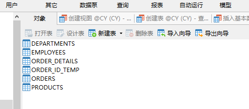

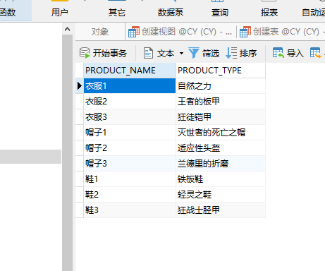

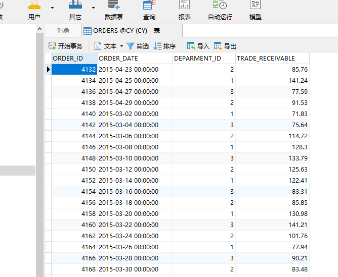

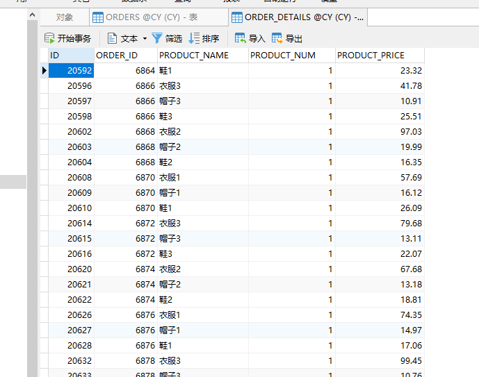

## 6. 创建视图

•     视图(view)，也称虚表, 不占用物理空间，这个也是相对概念，因为视图本身的定义语句还是要存储在数据字典里的。视图只有逻辑定义。每次使用的时候,只是重新执行SQL。

•     视图是从一个或多个实际表中获得的，这些表的数据存放在数据库中。那些用于产生视图的表叫做该视图的基表。一个视图也可以从另一个视图中产生。

•     视图的定义存在数据库中，与此定义相关的数据并没有再存一份于数据库中。通过视图看到的数据存放在基表中。

•     视图看上去非常象数据库的物理表，对它的操作同任何其它的表一样。当通过视图修改数据时，实际上是在改变基表中的数据；相反地，基表数据的改变也会自动反映在由基表产生的视图中。由于逻辑上的原因，有些Oracle视图可以修改对应的基表，有些则不能（仅仅能查询）。

•     还有一种视图：物化视图（MATERIALIZED VIEW ），也称实体化视图，快照 （8i 以前的说法） ，它是含有数据的，占用存储空间。

```
CREATE OR REPLACE FORCE EDITIONABLE VIEW "VIEW_ORDER_DETAILS" ("ID", "ORDER_ID",  "ORDER_DATE", "PRODUCT_TYPE", "PRODUCT_NAME", "PRODUCT_NUM", "PRODUCT_PRICE") AS
  SELECT
  d.ID,
  o.ORDER_ID,
  o.ORDER_DATE,
  p.PRODUCT_TYPE,
  d.PRODUCT_NAME,
  d.PRODUCT_NUM,
  d.PRODUCT_PRICE
FROM ORDERS o,ORDER_DETAILS d,PRODUCTS p where d.ORDER_ID=o.ORDER_ID and d.PRODUCT_NAME=p.PRODUCT_NAME; 

```

结果展示：

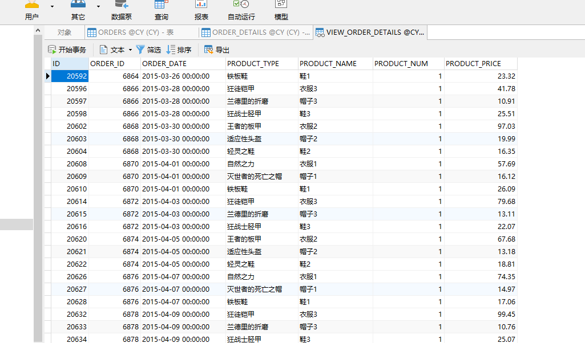

## 8. 向数据库中写入数据共计50000多个数据

```
declare
  dt date;
  m number(8,2);
  V_department_ID NUMBER(6);
  v_order_id number(10);
  v_name VARCHAR2 ( 100 );
  v number(10,2);

begin
  for i in 1..10000
  loop
    if i mod 2 =0 then
      dt:=to_date('2015-3-2','yyyy-mm-dd')+(i mod 60);
    else
      dt:=to_date('2016-3-2','yyyy-mm-dd')+(i mod 60);
    end if;
		
		
   V_department_ID:=CASE I MOD 3 + 1 WHEN 1 THEN 1 WHEN 2 THEN 2 ELSE 3 END;
    --插入订单
    v_order_id:=SEQ_ORDER_ID.nextval; --应该将SEQ_ORDER_ID.nextval保存到变量中。
  
    insert /*+append*/ into ORDERS (ORDER_ID,ORDER_DATE,门店号)
      values (v_order_id,dt,V_department_ID);

--插入订单y一个订单包括3个产品

    v:=dbms_random.value(100,40);
    v_name:='衣服'|| (i mod 3 + 1);
    insert /*+append*/ into ORDER_DETAILS(ID,ORDER_ID,PRODUCT_NAME,PRODUCT_NUM,PRODUCT_PRICE)
		  values (SEQ_ORDER_DETAILS_ID.NEXTVAL,v_order_id,v_name,1,v);
			
    v:=dbms_random.value(20,10);
    v_name:='帽子'|| (i mod 3 + 1);
    insert /*+append*/ into ORDER_DETAILS(ID,ORDER_ID,PRODUCT_NAME,PRODUCT_NUM,PRODUCT_PRICE)
      values (SEQ_ORDER_DETAILS_ID.NEXTVAL,v_order_id,v_name,1,v);
    v:=dbms_random.value(30,15);
    v_name:='鞋'|| (i mod 3 + 1);
    insert /*+append*/ into ORDER_DETAILS(ID,ORDER_ID,PRODUCT_NAME,PRODUCT_NUM,PRODUCT_PRICE)
      values (SEQ_ORDER_DETAILS_ID.NEXTVAL,v_order_id,v_name,1,v);
			
			
    --在触发器关闭的情况下，需要手工计算每个订单的应收金额：
    select sum(PRODUCT_NUM*PRODUCT_PRICE) into m from ORDER_DETAILS where ORDER_ID=v_order_id;
    if m is null then
     m:=0;
    end if;
   UPDATE ORDERS SET TRADE_RECEIVABLE = m  WHERE ORDER_ID=v_order_id;
    IF I MOD 1000 =0 THEN
      commit; --每次提交会加快插入数据的速度
    END IF;
  end loop;
  
  --dbms_stats.gather_schema_stats(User,estimate_percent=>100,cascade=> TRUE); 
end;

```


产品表


订单详细表


订单表

## 9. PL/SQL设计

 过程和函数由以下4部分： 

•     签名或头

•     关键字IS或AS

•     局部声明（可选）

•     BEGIN和END之间的过程体（包括异常处理程序）

 简单示例： 

```
create or replace procedure show_line(ip_line_length in number, ip_separator in varchar2)
is 
actual_line varchar2(150);
begin
     insert into t_user(id,name,sex)values(ip_line_length,ip_separator,ip_line_length);
     for idx in 1..ip_line_length loop
         actual_line := actual_line||ip_separator;
     end loop;
     dbms_output.put_line(actual_line);
exception when others then
          dbms_output.put_line(SQLERRM);
end;

```

### 9.2. 创建函数

#### 9.2.1. 查询部门所属总销售额

```
CREATE OR REPLACE
PACKAGE BODY "MYPACK" AS FUNCTION Get_SaleAmount ( "门店号" NUMBER ) RETURN NUMBER AS N NUMBER ( 20, 2 );
BEGIN
      SELECT SUM(O.TRADE_RECEIVABLE) into N  FROM ORDERS O,DEPARTMENTS D
      WHERE O."门店号"=D.DEPARTMENT_ID AND D.DEPARTMENT_ID ="门店号";
      RETURN N;
    END;
END; 
```

## 测试查询结果：

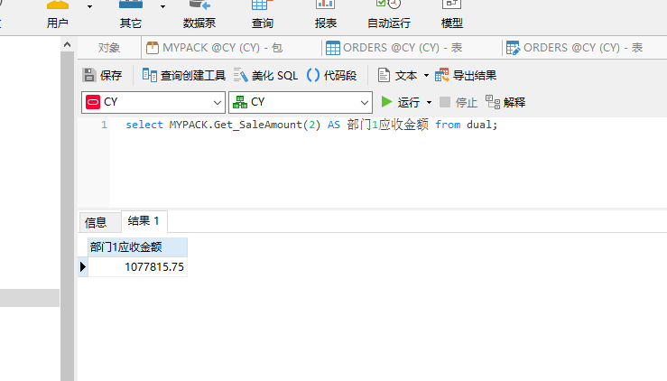

## 10. 数据库备份

**ORACLE****数据库备份与恢复详解**

Oracle的备份与恢复有三种标准的模式，大致分为两 大类，备份恢复(物理上的)以及导入导出(逻辑上的)，而备份恢复又可以根据数据库的工作模式分为非归档模式(Nonarchivelog-style) 和归档模式(Archivelog-style),通常，我们把非归档模式称为冷备份，而相应的把归档模式称为热备份。

### 热备份和冷备份优缺点

#### 热备份的优点是：

 1．可在表空间或数据文件级备份，备份时间短。

 2．备份时数据库仍可使用。 

 3．可达到秒级恢复（恢复到某一时间点上）。 

 4．可对几乎所有数据库实体作恢复。 

 5．恢复是快速的，在大多数情况下在数据库仍工作时恢复。 

#### 热备份的不足是：

 1．不能出错，否则后果严重。

 2．若热备份不成功，所得结果不可用于时间点的恢复。 

 3．因难维护，所以要特别仔细小心，不允许“以失败而告终”。 

#### 冷备份的优点是：

 1．是非常快速的备份方法（只需拷贝文件）

 2．容易归档（简单拷贝即可） 

 3．容易恢复到某个时间点上（只需将文件再拷贝回去） 

 4．能与归档方法相结合，作数据库“最新状态”的恢复。

 5．低度维护，高度安全。 

#### 冷备份不足是：

 1．单独使用时，只能提供到“某一时间点上”的恢复。 

 2．在实施备份的全过程中，数据库必须要作备份而不能作其它工作。也就是说，数据库必须是关闭状态。

 3．若磁盘空间有限，只能拷贝到磁带等其它外部存储设备上，速度会很慢。 

 4．不能按表或按用户恢复。

### 物理备份之冷备份：

 当数据库可以暂时处于关闭状态时，我们需要将它在这一稳定时刻的数据相关文件转移到安全的区域，当数据库遭到破坏，再从安全区域将备份的数据库相关文件拷 贝回原来的位置，这样，就完成了一次快捷安全等数据转移。由于是在数据库不提供服务的关闭状态，所以称为冷备份。冷备份具有很多优良特性，比如上面图中我 们提到的，快速，方便，以及高效。一次完整的冷备份步骤应该是：

 1，首先关闭数据库（shutdown normal）

 2，拷贝相关文件到安全区域（利用操作系统命令拷贝数据库的所有的数据文件、日志文件、控制文件、参数文件、口令文件等（包括路径））

 3，重新启动数据库（startup）

这样，我们就完成了一次冷备份，请确定你对这些相应的目录（包括写入的目标文件夹）有相应的权限。

 恢复的时候，相对比较简单了，我们停掉数据库，将文件拷贝回相应位置，重启数据库就可以了，当然也可以用脚本来完成。

## 10.1. 手动数据库备份之数据库导出expdp

### 步骤：

SQL plus 已SYSTEM 用户登录

创建expdir目录并给用户授权读写

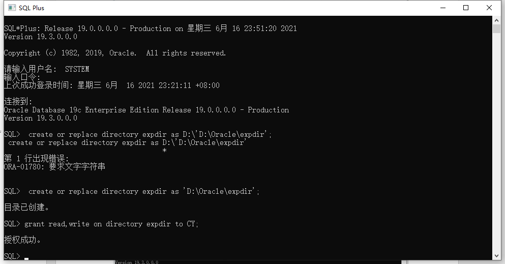

用户自己备份

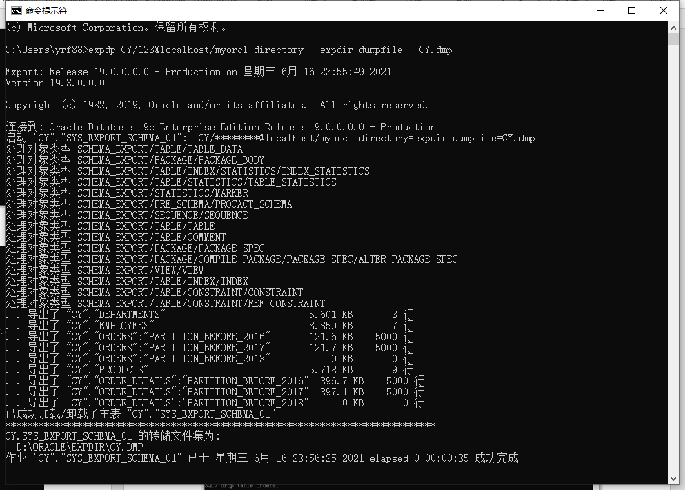

前往本地目录查看：

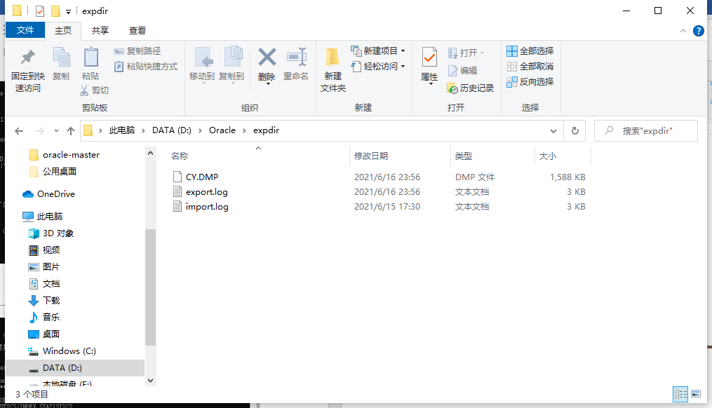

### 10.5. 删除数据库文件模拟数据损坏

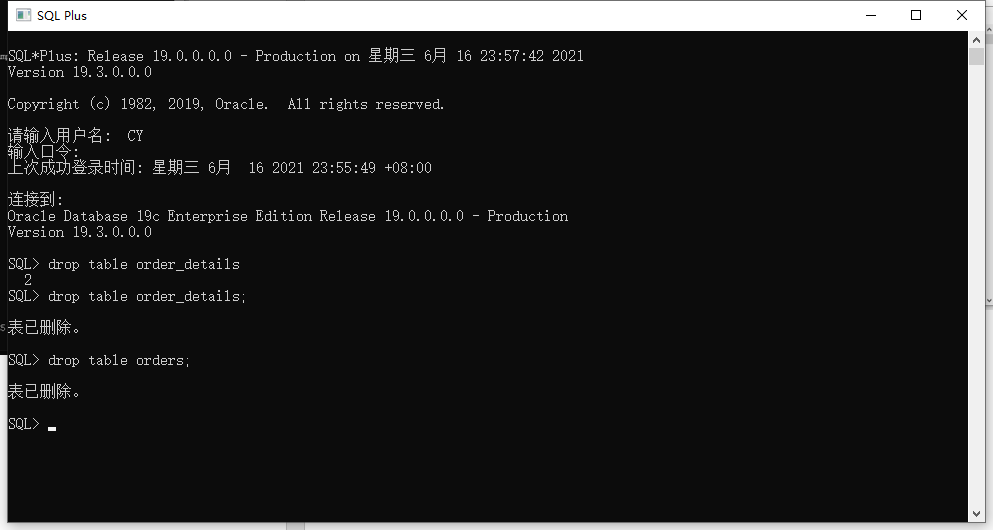

### 10.6. 数据库完全恢复

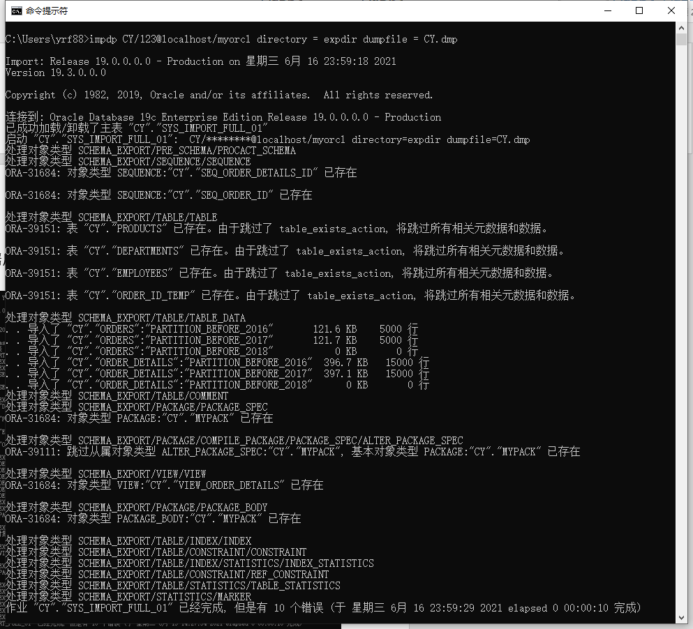

用户登录数据库查看恢复情况;

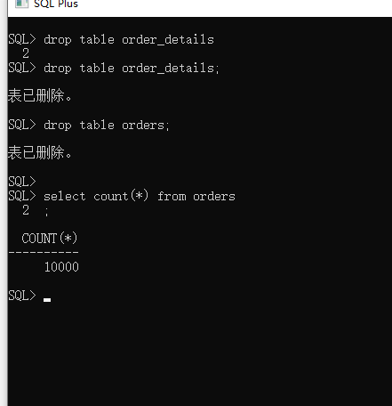

数据完全恢复。